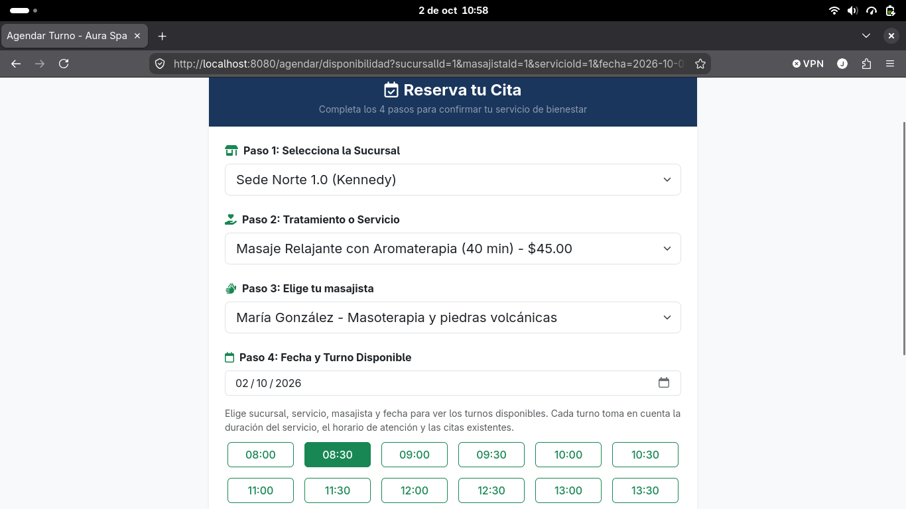
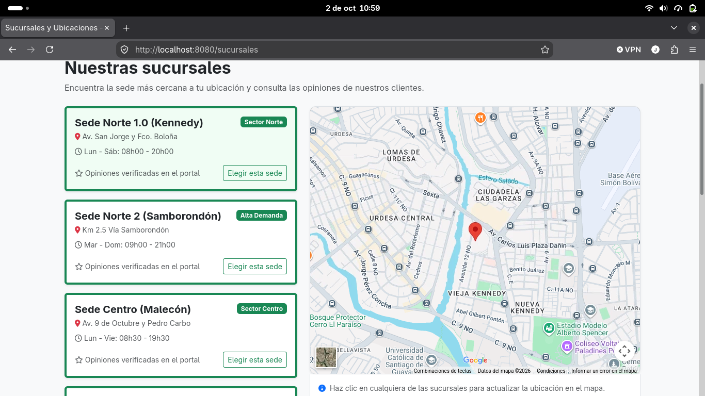
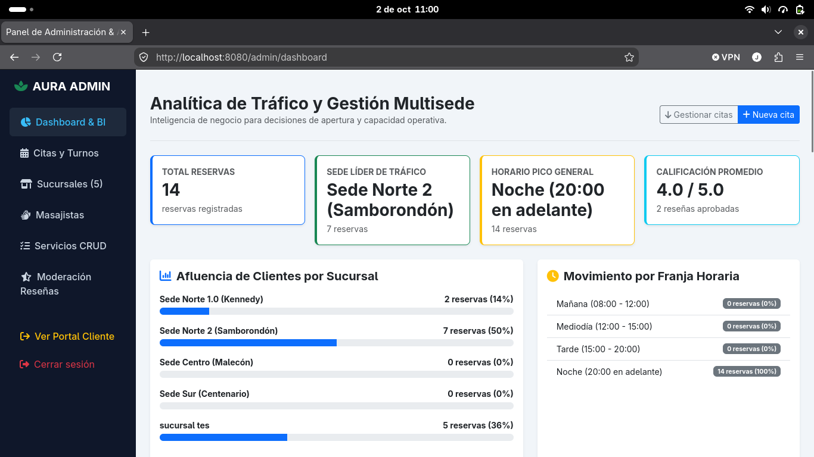
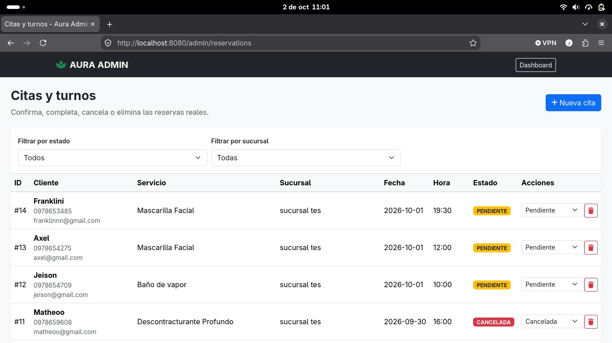

# 🌿 Aura Spa

<p align="center">
  Sistema web para la gestión integral de un spa, desarrollado con
  <strong>Java, Spring Boot, Thymeleaf y PostgreSQL</strong>.
</p>

<p align="center">
  Reservas · Sucursales · Masajistas · Servicios · Reseñas · Administración · Analítica
</p>

---

## 📖 Descripción

**Aura Spa** es una aplicación web diseñada para gestionar las operaciones principales de un spa desde una única plataforma.

El sistema permite a los clientes consultar sucursales, explorar servicios, seleccionar profesionales y agendar citas según la disponibilidad real de cada masajista.

Además, incorpora un portal administrativo para gestionar reservas, servicios, sucursales, masajistas y reseñas, junto con información estadística para facilitar el seguimiento de la actividad del negocio.

---

## 🖥️ Vista del sistema

### Página principal


### Sistema de reservas



### Sucursales



### Dashboard administrativo



### Gestión de reservas



---

## ✨ Funcionalidades principales

### 👤 Portal del cliente

- Consulta de servicios disponibles.
- Visualización de sucursales.
- Selección de sucursal y masajista.
- Agendamiento de citas.
- Cálculo automático de horarios disponibles.
- Validación de fechas y horarios.
- Prevención de reservas superpuestas.
- Consulta privada de reservas.
- Sistema de reseñas.

### 🔐 Portal administrativo

- Inicio de sesión administrativo.
- Dashboard de gestión.
- Administración de servicios.
- Administración de sucursales.
- Administración de masajistas.
- Gestión y filtrado de reservas.
- Cambio de estado de las citas.
- Gestión de reseñas.
- Visualización de estadísticas del negocio.

### 📅 Gestión de reservas

Las reservas pueden manejar diferentes estados durante su ciclo:

- `PENDIENTE`
- `CONFIRMADA`
- `COMPLETADA`
- `CANCELADA`

El sistema calcula los turnos disponibles teniendo en cuenta el horario de la sucursal, la duración del servicio y las reservas activas del profesional seleccionado.

---

## 🛠️ Tecnologías utilizadas

| Tecnología | Uso |
|---|---|
| **Java 21 LTS** | Lenguaje principal |
| **Spring Boot 4.1.1** | Framework backend |
| **Spring MVC** | Controladores y flujo web |
| **Spring Data JPA** | Persistencia de datos |
| **Spring Security** | Seguridad y autenticación |
| **Thymeleaf** | Renderizado de las interfaces |
| **PostgreSQL** | Base de datos |
| **Hibernate** | ORM |
| **Maven** | Gestión de dependencias y compilación |
| **JUnit** | Pruebas automatizadas |
| **HTML / CSS / JavaScript** | Interfaz web |

---

## 🏗️ Arquitectura del proyecto

El proyecto sigue una arquitectura basada en las capas habituales de una aplicación Spring Boot:

```text
src/
├── main/
│   ├── java/com/spa/sistema_spa/
│   │   ├── WebController.java
│   │   ├── ReservationBookingService.java
│   │   ├── ReservationNotificationService.java
│   │   ├── BookingAvailability.java
│   │   ├── SecurityConfiguration.java
│   │   ├── Reservation.java
│   │   ├── Branch.java
│   │   ├── Masseuse.java
│   │   ├── SpaService.java
│   │   ├── Review.java
│   │   └── *Repository.java
│   │
│   └── resources/
│       ├── application.properties
│       └── templates/
│
└── test/
    ├── java/
    └── resources/
```

### Componentes principales

**Controladores**
Gestionan las solicitudes HTTP y la navegación entre las diferentes vistas.

**Servicios**
Contienen la lógica relacionada con reservas, disponibilidad y notificaciones.

**Repositorios**
Gestionan el acceso y persistencia de información mediante Spring Data JPA.

**Entidades**
Representan los elementos principales del sistema:

- Reservas
- Servicios
- Sucursales
- Masajistas
- Reseñas

**Thymeleaf**
Permite generar dinámicamente las páginas que utiliza el cliente y el administrador.

---

## 🗄️ Base de datos

Aura Spa utiliza **PostgreSQL**.

La configuración puede proporcionarse mediante variables de entorno:

```bash
export DB_URL=jdbc:postgresql://localhost:5432/aura_spa2
export DB_USERNAME=postgres
export DB_PASSWORD=tu_clave_de_postgres
```

La base contiene la información relacionada con:

- Servicios
- Sucursales
- Masajistas
- Reservas
- Reseñas

> El respaldo de la base de datos no se incluye en el repositorio público para evitar publicar información almacenada localmente.

---

## 🚀 Ejecución del proyecto

### Requisitos

Antes de ejecutar Aura Spa necesitas:

- JDK 21
- PostgreSQL
- Git

No es necesario instalar Maven globalmente porque el proyecto incluye **Maven Wrapper**.

### 1. Clonar el repositorio

```bash
git clone https://github.com/Julianrma/sistema-spaa.git
cd sistema-spaa
```

### 2. Configurar PostgreSQL

Crea una base de datos:

```sql
CREATE DATABASE aura_spa2;
```

Después configura las credenciales mediante variables de entorno:

```bash
export DB_URL=jdbc:postgresql://localhost:5432/aura_spa2
export DB_USERNAME=postgres
export DB_PASSWORD=tu_clave_de_postgres
```

### 3. Ejecutar Aura Spa

En Linux:

```bash
./mvnw spring-boot:run
```

En Windows:

```powershell
.\mvnw.cmd spring-boot:run
```

Una vez iniciado el servidor, abre:

```text
http://localhost:8080
```

---

## 🔐 Acceso administrativo

El proyecto incluye un acceso administrativo para fines de demostración.

Para un despliegue real se recomienda configurar las credenciales mediante:

```bash
export SPA_ADMIN_USERNAME=tu_usuario
export SPA_ADMIN_PASSWORD=tu_contraseña
```

El acceso administrativo está disponible en:

```text
http://localhost:8080/admin/login
```

> Las credenciales utilizadas para una demostración no deben reutilizarse como credenciales personales o de producción.

---

## 🧪 Pruebas

El proyecto cuenta con pruebas automatizadas para componentes importantes del sistema, incluyendo:

- Credenciales administrativas.
- Disponibilidad de horarios.
- Control de intentos de inicio de sesión.
- Flujo de reservas.
- Contexto de la aplicación.

Para ejecutar la suite:

```bash
./mvnw test
```

Para realizar una compilación limpia:

```bash
./mvnw clean compile
```

---

## 🔒 Seguridad

Aura Spa incorpora diferentes medidas de protección dentro de la aplicación:

- Spring Security.
- Protección CSRF.
- Control de acceso administrativo.
- Control de intentos de inicio de sesión.
- Validaciones del proceso de reserva.
- Prevención de conflictos de disponibilidad.
- Configuración sensible mediante variables de entorno.

---

## 📌 Estado del proyecto

Aura Spa se encuentra en desarrollo y ha sido construido como proyecto académico, aplicando conceptos de desarrollo web, arquitectura backend, persistencia de datos, seguridad y pruebas automatizadas.

---

## 👨‍💻 Autor

**Julián Revelo**

Desarrollo y documentación del proyecto **Aura Spa**.

---

<p align="center">
  🌿 <strong>Aura Spa</strong><br>
  Gestión, reservas y administración en una sola plataforma.
</p>